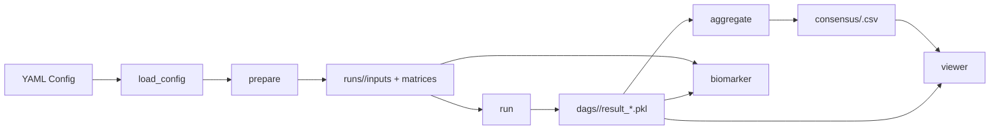

# CSCN Design And Development

本文档面向开发者，描述当前 `cscn` 仓库的目标边界、模块分层、数据流、运行目录协议，以及后续扩展时应遵守的开发约定。

如果你只想知道配置怎么写，可以先读 [Configuration](configuration.md)。如果你只关心图浏览器，可以读 [DAG Viewer](dag_viewer.md)。

## 1. Project Positioning

当前仓库为“通用 scRNA CSCN 工作流仓库”。它的正式接口是：

- Python 包：`src/cscn/`
- CLI：`cscn`
- 配置：YAML
- 标准输出：`runs/<run_name>/`

当前仓库仍然保留大量 legacy 资产，但职责已经重新划分：

- `src/cscn/`：正式主实现，负责新的配置化工作流
- `src/biomarker/`：历史算法实现、biomarker 逻辑和 viewer 兼容能力
- `configs/`：新 CLI 的配置模板
- `legacy/`、旧脚本：保留参考，不作为主入口

这意味着当前架构不是“彻底重写”，而是“用新的 orchestration 层包装并收敛旧算法能力”。

## 2. Design Goals

当前设计主要服务以下目标：

- 统一入口：不同数据集尽量复用同一套 CLI 和配置结构
- 阶段解耦：数据准备、CSCN 运行、共识聚合、biomarker、viewer 可以分步执行
- 结果可复用：中间产物全部落盘，便于失败恢复、独立调试和下游工具消费
- 与历史实现兼容：尽量复用现有 CSCN 核心算法和 viewer 图归一化逻辑
- 面向目录协议开发：后续工具优先读标准 run 目录，而不是直接耦合内部 Python 对象

## 3. Non-Goals

当前版本没有试图解决以下问题：

- 没有把底层 CSCN 核心算法完全迁移到 `src/cscn/`
- 没有建立插件化的 preprocess/aggregate/postprocess 体系
- 没有提供数据库或任务调度系统，状态仍以文件系统为主
- 没有对超大规模 scRNA 数据集做专门的 out-of-core 优化
- 没有为所有阶段建立完整自动化测试覆盖

这些不是 bug，而是当前版本的边界。

## 4. High-Level Architecture

整体调用链如下：



从分层角度可以理解为四层：

### 4.1 Interface Layer

- `src/cscn/cli.py`

职责：

- 解析命令行参数
- 读取配置
- 分发到工作流函数

### 4.2 Workflow Layer

- `src/cscn/workflow.py`

职责：

- 组织各阶段执行顺序
- 负责 run 目录写入与读取
- 把配置映射到具体模块调用

### 4.3 Data Preparation And Aggregation Layer

- `src/cscn/config.py`
- `src/cscn/io.py`
- `src/cscn/prep.py`
- `src/cscn/layout.py`
- `src/cscn/aggregate.py`

职责：

- 配置解析和校验
- 输入数据标准化
- 预处理和采样
- 目录协议管理
- 共识边聚合

### 4.4 Algorithm / Legacy Capability Layer

- `src/cscn/core.py`
- `src/cscn/postprocess/biomarker.py`
- `src/biomarker/*`

职责：

- 复用现有 CSCN 算法实现
- 复用现有 biomarker 能力
- 复用旧 viewer 的图序列化与兼容读取逻辑

## 5. Module Responsibilities

### `src/cscn/cli.py`

定义了 6 个正式子命令：

- `prepare`
- `run`
- `aggregate`
- `biomarker`
- `run-all`
- `viewer`

特点：

- 所有命令统一要求 `--config`
- CLI 本身不含业务逻辑，只做入口分发
- `viewer` 子命令在命令级才导入 `uvicorn`

### `src/cscn/config.py`

负责：

- 把 YAML 解析为 dataclass 结构
- 做基础字段校验
- 解析相对路径
- 生成可序列化配置快照

设计要点：

- 配置在进入业务流程前就转为强类型 dataclass
- 配置中所有路径在加载时就解析为绝对 `Path`
- 配置快照由 `serialize_config()` 统一输出，保证落盘内容稳定

### `src/cscn/io.py`

负责：

- 读取 `h5ad`
- 读取 CSV/TSV/GZ 表格
- 对齐 expression 与 metadata
- 输出统一 `LoadedDataset`

设计要点：

- 内部统一把表达矩阵变成 `cells x genes`
- 通过共享 cell id 做 expression/metadata 对齐
- 重名基因在这里统一处理，避免后续索引歧义

### `src/cscn/prep.py`

负责：

- 选择 gene list
- 按 group 划分细胞
- group 内采样
- normalization 和 `log1p`
- 生成 `PreparedRunData`

设计要点：

- gene 选择在全局数据上完成，再切分到 group
- 采样在 group 内独立进行，保证组间样本规模可控
- 输出显式保留 `sampled_metadata`，便于后续 biomarker 和调试

### `src/cscn/layout.py`

负责：

- 管理标准 run 目录结构
- 统一路径拼装方式

这是一个很关键但经常被忽略的模块。当前仓库很多“模块解耦”实际上依赖于它定义的目录协议，而不是依赖复杂的对象模型。

### `src/cscn/workflow.py`

负责：

- `prepare_run`
- `load_prepared_run`
- `run_cscn`
- `aggregate_run`
- `run_biomarker_workflow`
- `run_all`

设计要点：

- `prepare` 负责把输入转成稳定的中间文件
- `run` 和 `aggregate` 默认依赖这些中间文件，而不是重新读原始数据
- `run_all` 只是组合命令，不引入新逻辑

### `src/cscn/aggregate.py`

负责：

- 载入 group 下的所有 DAG
- 节点 id 到 gene label 的映射
- 统计共识边
- 写出共识 CSV

设计要点：

- 共识图本质上是“边频数过滤结果”
- 共识输出优先写成 CSV，而不是新的二进制格式，方便外部工具直接消费

### `src/cscn/core.py`

当前只是：

- 对 `biomarker.cscn.CSCN` 的 re-export

这说明仓库已经完成了接口收敛，但尚未完成算法内核迁移。对开发者来说，这个边界必须明确：如果要修改 CSCN 的内部算法行为，目前仍要进入 `src/biomarker/` 体系。

### `src/cscn/postprocess/biomarker.py`

负责：

- 从 prepared 矩阵构建 biomarker 需要的表达数据
- 把 case/control group 的 DAG 映射到基因图
- 调用 legacy biomarker 识别逻辑
- 输出标准 biomarker 结果文件

### `src/cscn/viewer.py`

负责：

- 新版 run-root 发现逻辑
- FastAPI 路由暴露
- 前端静态资源托管

同时复用：

- `src/biomarker/dag_viewer/service.py` 中的图对象标准化和 pickle 兼容逻辑

## 6. Standard Run Directory Protocol

标准输出目录是当前设计的核心契约。

```text
runs/<run_name>/
  config.snapshot.yaml
  inputs/
    genes.csv
    groups.csv
    cell_metadata.csv
    run_summary.json
  matrices/
    <group>.npy
    <group>_cells.csv
  dags/
    <group>/
      result_0.pkl
      result_1.pkl
      ...
  objects/
    <group>_cscn.pkl
  consensus/
    <group>.csv
    summary.json
  biomarker/
    biomarkers.csv
    causal_summary.json
  logs/
```

### Why This Matters

这个目录协议承担了三种职责：

- 阶段间接口：`run` 读 `prepare` 的输出，`aggregate` 读 `run` 的输出
- 故障恢复：任何阶段失败后，都可以从上一个稳定阶段继续
- 工具消费：viewer 和其他下游分析工具只需要读目录，不需要依赖运行时对象

### File-Level Semantics

#### `config.snapshot.yaml`

- 记录本次 run 的配置快照
- 便于追溯结果是如何生成的

#### `inputs/genes.csv`

- 列：`node_index`, `gene_name`
- 用于把 DAG 中的整数节点编号映射回基因名

#### `inputs/groups.csv`

- 列：`group_key`, `group_label`, `n_cells`
- `group_key` 是路径/文件安全的逻辑分组名

#### `inputs/cell_metadata.csv`

- 采样之后的 metadata，而不是原始 metadata
- 第一列总会补成 `cell_id`

#### `matrices/<group>.npy`

- 该 group 的预处理后矩阵
- 行顺序与 `<group>_cells.csv` 完全对应

#### `matrices/<group>_cells.csv`

- 记录该 group 每一行矩阵对应哪个 cell id
- 同时也是 viewer 反查 `resultId -> cell_id` 的依据

#### `dags/<group>/result_<i>.pkl`

- 第 `i` 个单细胞 DAG
- `i` 被解释为组内细胞顺序，而不是数据库意义上的主键

#### `objects/<group>_cscn.pkl`

- 完整 `CSCN` 对象序列化结果
- 主要用于调试和算法复用

#### `consensus/<group>.csv`

- group 级共识边
- 列：`from`, `to`, `count`, `threshold`, `num_dags`

#### `consensus/summary.json`

- 聚合结果摘要
- 用于快速查看每组阈值和边数

## 7. End-To-End Execution Flow

### 7.1 `cscn prepare`

1. 解析配置
2. 加载原始数据
3. 统一 expression/metadata 结构
4. 筛选基因
5. 按 group 切分
6. 采样细胞
7. normalization + `log1p`
8. 写出 run 目录中的 `inputs/` 和 `matrices/`

这一步的目标是把原始数据转为稳定、可复现、可检查的中间状态。

### 7.2 `cscn run`

1. 从 `inputs/`、`matrices/` 重建 `PreparedRunData`
2. 对每个 group 初始化 `CSCN`
3. 运行 `run_core`
4. 并发运行 `run_pc_concurrently`
5. 保存 `CSCN` 对象和单细胞 DAG pickle

设计上，这一步完全不需要重新读取原始输入文件。

### 7.3 `cscn aggregate`

1. 读取 `inputs/genes.csv`
2. 枚举每个 group 下的 `result_*.pkl`
3. 统计边出现次数
4. 应用阈值策略
5. 写出 `consensus/<group>.csv`

### 7.4 `cscn biomarker`

1. 读取 prepared 矩阵和元数据
2. 只保留 `case_group` 与 `control_group`
3. 把 DAG 映射为 gene-level group graph
4. 调用 legacy biomarker 推断逻辑
5. 写出 biomarker 结果

### 7.5 `cscn viewer`

1. 根据配置确定 `run.output_dir`
2. 扫描兼容 run root
3. 选择默认 run
4. 按需读取单细胞 DAG 或共识 DAG
5. 返回序列化图结构供前端渲染

## 8. Data Model Notes

### 8.1 Expression Matrix Convention

内部统一使用：

- 行：cells
- 列：genes

即使原始表格是 `genes x cells`，也会在 `io.py` 中转置后再进入后续流程。

### 8.2 Metadata Alignment Convention

metadata 永远通过 cell id 与 expression 对齐。对齐后：

- metadata 顺序与 expression 行顺序一致
- 未对齐上的细胞会被丢弃
- 如果共享 cell id 为空，直接报错

### 8.3 Group Convention

group 是一个逻辑概念，不强制要求时间点或细胞类型结构。当前系统只要求：

- metadata 中存在一个可分组列
- 每个 group 能映射到一组 cell id

因此 `disease`、`cell_type`、`condition`、`timepoint` 都可以成为 group 列。

## 9. Compatibility With Legacy Code

这是当前开发最容易踩坑的地方。

### 9.1 Legacy Dependencies Still In Use

正式工作流仍直接依赖以下 legacy 能力：

- `biomarker.cscn.CSCN`
- `biomarker.datasets.load_gene_names`
- `biomarker.datasets.build_expression_df`
- `biomarker.graph_utils.identify_biomarkers_from_group_graphs`
- `biomarker.dag_viewer.service.*`

### 9.2 Why This Is Acceptable For Now

这样做的好处是：

- 新入口能尽快稳定
- 历史结果格式和行为不需要一次性推翻
- viewer 和 biomarker 不需要在重构早期同步重写

代价是：

- 逻辑分层还不彻底
- 部分“新模块”只是 orchestration 层
- 对底层算法的理解仍需要跨到 `src/biomarker/`

### 9.3 Practical Rule

开发时可以遵守一个简单规则：

- 改工作流、目录结构、配置语义，看 `src/cscn/`
- 改 CSCN 算法、biomarker 细节、图对象兼容逻辑，看 `src/biomarker/`

## 10. Configuration As Public API

对当前仓库来说，YAML 配置本身就是外部 API。

这意味着：

- 新增字段时，优先考虑向后兼容
- 字段更名要谨慎，最好保留兼容路径
- 相对路径解析规则不要轻易改
- `run_name` 和目录布局不要随意破坏，否则 viewer 和下游脚本都会受影响

建议把配置变更分成三类处理：

- 新增可选字段：最安全
- 改默认值：需要在文档中明确说明
- 删除或重命名字段：除非必要，否则避免

## 11. Extension Playbook

### 11.1 Add A New Input Format

需要同步修改：

- `src/cscn/config.py`
- `src/cscn/io.py`
- `docs/configuration.md`

推荐步骤：

1. 在 `InputConfig` 中添加字段
2. 在 `load_config()` 中校验并解析
3. 在 `load_dataset()` 中新增分支
4. 保证输出仍是统一 `LoadedDataset`
5. 更新示例配置和文档

核心原则：不要把下游阶段改成感知多种输入格式，下游只应感知统一数据模型。

### 11.2 Add A New Preprocess Strategy

需要优先考虑：

- 是否影响 gene 数量和 node index 的稳定性
- 是否需要写入额外的 `inputs/` 元数据
- viewer 是否仍能正确映射节点到基因名

如果引入新的 gene 选择策略，至少应确保：

- 最终基因顺序明确
- `inputs/genes.csv` 与 DAG 节点索引保持一致

### 11.3 Add A New Aggregation Strategy

推荐修改：

- `src/cscn/aggregate.py`

原则：

- 优先保持输出 CSV 契约稳定
- 如果必须改变字段，先评估 viewer 是否依赖这些字段
- viewer 更适合作为消费者，不适合承担复杂聚合逻辑

### 11.4 Add A New Postprocess Stage

推荐方式：

1. 在 `src/cscn/postprocess/` 新增模块
2. 在 `workflow.py` 添加独立函数
3. 决定是否纳入 `run-all`
4. 在 `RunLayout` 中为产物预留目录

不要把新的后处理逻辑直接塞进 `aggregate_run()` 或 `run_cscn()` 里，否则阶段边界会变糊。

### 11.5 Extend Viewer Metadata

如果只是想在前端显示更多 group/cell 信息，优先从 run 目录中显式落盘，再让 viewer 去读取，而不是让 viewer 重新推导原始输入信息。

这样做的好处：

- 调试路径更短
- viewer 更轻
- 数据语义更稳定

## 12. Development Workflow Recommendations

### 12.1 Preferred Iteration Loop

推荐按这个顺序开发：

1. 先修改配置与数据模型
2. 再修改 `prepare`
3. 再修改 `run` 或 `aggregate`
4. 最后检查 viewer 是否仍能读取产物

原因很简单：viewer 是消费端，先把生产端协议稳定下来更高效。

### 12.2 When To Regenerate A Run

不同改动需要重跑的阶段不同：

| 改动类型 | 最低需要重跑 |
| --- | --- |
| 配置路径、输入解析、gene 选择、采样逻辑 | `prepare` 及其后全部 |
| CSCN 算法参数或运行逻辑 | `run` 及其后全部 |
| 共识阈值或聚合逻辑 | `aggregate` 及其后 viewer |
| biomarker 逻辑 | `biomarker` |
| 纯 viewer 前端或 API 渲染 | 一般不需要重算 run |

### 12.3 Debugging Checklist

排查问题时，建议按目录逐层检查：

1. `config.snapshot.yaml` 是否符合预期
2. `inputs/genes.csv` 基因顺序是否正确
3. `inputs/groups.csv` group 是否正确
4. `matrices/<group>_cells.csv` 行数是否与 `.npy` 一致
5. `dags/<group>/result_*.pkl` 数量是否与 cell 数一致
6. `consensus/<group>.csv` 是否生成
7. viewer `/api/scan` 和 `/api/graph` 是否能正确读取

## 13. Known Architectural Tradeoffs

### Tradeoff 1: File-Based Interface Instead Of In-Memory Pipeline

优点：

- 稳定
- 易调试
- 易恢复

代价：

- 会产生较多中间文件
- 需要维护目录协议

### Tradeoff 2: Reuse Legacy Core Instead Of Immediate Rewrite

优点：

- 降低重构风险
- 尽快统一新入口

代价：

- 代码边界仍不够纯
- 开发者需要同时理解 `src/cscn/` 和 `src/biomarker/`

### Tradeoff 3: Viewer Reads Files, Not Python Objects

优点：

- 前后端解耦
- viewer 可以离线读已有结果目录

代价：

- 目录协议一旦变化，需要同步更新 viewer

## 14. Suggested Near-Term Refactors

如果继续演进，优先级较高的改造建议是：

1. 把 `src/cscn/core.py` 从 re-export 升级为真正的本地算法封装层。
2. 把 viewer 的图归一化逻辑从 `src/biomarker/dag_viewer/service.py` 抽到 `src/cscn/` 命名空间。
3. 为 `prepare`、`aggregate`、`viewer` 增加更系统的测试。
4. 给 run 目录增加更明确的 schema version。
5. 让 `viewer.enabled` 从“声明字段”变成真正可用于 CLI/部署决策的配置。

## 15. Practical Summary

如果只记三件事，应该是：

- `runs/<run_name>/` 是整个系统最重要的公共契约。
- `src/cscn/` 负责工作流和协议，`src/biomarker/` 仍承载底层算法与部分兼容逻辑。
- 新功能优先接入统一目录和配置体系，而不是再新增 dataset-specific 入口。
